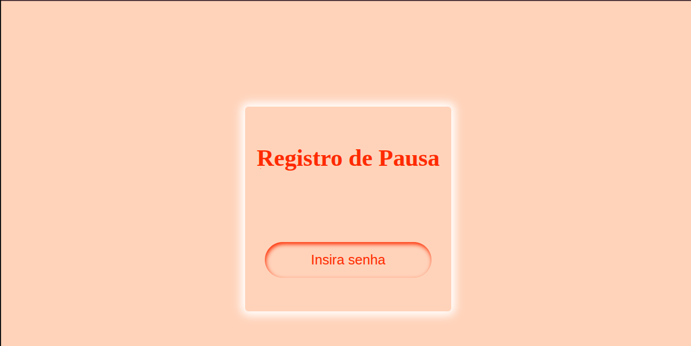

# Copa
App Flask para autentificação (Entrada e saída) e contabilização de tempo de descanso em ambiente de indústria

## Aquivo principal

> O app.py é o arquivo Flask que gerencia as rotas que serão exibidas em um notebook e uma TV. Essas rotas remetem a autentificiação do usuário e  cronometragem.
> A bilioteca webbrowser serve como uma garantia e praticiadade da abertura das rotas.

> Nesse arquivo também é gerenciado o envio para o banco de dados e o dialogo entre as duas rotas. No momento que o colaborador se autentica é guardado o nome e a hora e em sequida é enviado uma mensagem para o template relógio via rota "/recebendo".

> Para que o usuário fique alerta sobre seu tempo de descanso, adicionei uma rota POST que é utilizado como aviso de que o tempo acabou. A biblioteca pygame me tornou mais prática para esse projeto.

`

    from flask import Flask,render_template,jsonify,request
    from db_autentificacoes import inserir_autentificacao,backup
    from ativando_bipe import bipe
    import webbrowser

    app = Flask(__name__)

    nome= {"nome": ""}
    webbrowser.open("http://127.0.0.1:5000/")
    webbrowser.open("http://127.0.0.1:5000/relogio")

    @app.route("/")
    def copa():

        return render_template("copa.html")

    @app.route("/relogio")
    def relogio():
        return render_template("relogio.html")

    @app.route("/envio", methods=["POST"])
    def envio():
        dado = request.get_json()
        nome["nome"] = dado.get("nome","")
        if nome["nome"] != "":
            inserir_autentificacao(nome["nome"])
        return jsonify(nome)

    @app.route("/bipe",methods=["POST"])
    def rota_bipe():
        dado = request.get_json()
        som_bipe = dado.get("bipe")
        if som_bipe == "bipe":
            bipe()

    @app.route("/recebendo",methods=["GET"])
    def recebendo():
        backup()
        return jsonify(nome)

    if __name__=="__main__":
        app.run()
`

## Autetificação

> Utilizando a biblioteca tinydb, crio um banco de dados simples, leve e fácil de utilizar. Assim armazendo os dados de autentificação
> O banco de dados com nome e hora serão enviado via API App Script para uma planilha Google Sheets. Essa planilha é usada para monitoramento da gestão.

`

    from tinydb import TinyDB,Query
    from datetime import datetime
    import requests

    db = TinyDB("autentificacoes.json")
    url = ""

    def inserir_autentificacao(nome):
        agora = datetime.now()

        autentificacao = {
        "Nome": nome,
        "Data": agora.strftime("%d/%m/%Y"),
        "Hora": agora.strftime("%H:%M:%S")
        }

        db.insert(autentificacao)

    def backup():
        hora = datetime.now().strftime("%H:%M")

        if hora == "16:30" or hora == "16:50":
            todos_registros = db.all()

            if len(todos_registros) > 0 :
                valores_dos_registros = [list(registros.values()) for registros in todos_registros ]
                resposta = requests.post(url, json={"dados":valores_dos_registros})
                while resposta.status_code != 200:
                    resposta = requests.post(url, json={"dados":valores_dos_registros})

                db.truncate()

    db.truncate()

`

## Alerta! Descanso finalizado

> Quando finaliza o tempo de descanso, é acionada a função bipe() que tocar um mp3 de som de capainha.

`

    import pygame

    def bipe():
        pygame.init()
        pygame.mixer.init()
        pygame.mixer.music.load("airplane-beep-sound-effect.mp3")
        pygame.mixer.music.play()

        while pygame.mixer.music.get_busy():
            pass

`

## Área Frontend 

### A praticidade  do jquery foi o que me fez escolhe-lo. Ótimo para uma aplicações curtas

`

    $(document).ready(function(){

        //================================================ 
        // essa é a div onde os relógios serão adicionados
        // ===============================================

        const $conteinerRelogio = $(".conteiner-relogio")
        const $audio = $("#alarme");

        // ==============================================

        //================================================ 
        // essa é a div onde os relógios serão adicionados
        // ===============================================
        function vibrarRelogio(div){
            div.css('position', 'relative'); //deixa o conteiner livre para movimentar 
            div.css("animation", "pulse 1s infinite");

        }

      // ==============================================
      // nessa função terá a lógica para que o relógio funcione
      // ==============================================
      async function contator(nome,div){
        // variavel que irá percorrer pelo código 
        var valorIniciar = "00:10:00";

        // essa função irá pegar o valor inicial e transformar em segundos
        async function converterEmSegundos(valor){
          let stringSeparado = valor.split(":") //separando o texto para poder fazer o calculo
          let emSegundos = parseInt(stringSeparado[1]) *60 + parseInt(stringSeparado[2]) // transformando em segundos
          valorIniciar =  emSegundos; //agora o valor inicial será em segundos
        }

        // essa função transformará segundos em string para ser exibida na tela
        async function converterString(valor){
            let minuto = String(parseInt(valor/60)).padStart(2,0); //formatado para ter dois caracteres
            let segundo = String(valor % 60).padStart(2,0);

            valorIniciar = `00:${minuto}:${segundo}` //agora valorInicial será uma string
        }

        // esse processo assincro será utilizado para a contagem regressiva
        let converter = setInterval(()=>{
            // transformar em segundos
            converterEmSegundos(valorIniciar)
            // diminuir
            valorIniciar --
            if(valorIniciar <= -1){
              clearInterval(converter)
              div.css("background", "red");
              vibrarRelogio(div)
              fetch("/bipe",{
            
                method: "POST",
                headers:{
                "Content-Type": "application/json",
                        },
                body: JSON.stringify({"bipe":"bipe"})

              }).then(data => data)
            }else{
            
            // mostrar tempo atual
            converterString(valorIniciar)
            if(valorIniciar == "00:01:00"){
              div.css("background", "yellow");
            }
              // mostrar tempo atual
            div.find(".numeros").last().text(valorIniciar)

            }

        },1000)

      }

    async function addPainel(cola){
      // criar div relogio
      let $relogio = $("
").addClass("relogio");

      let $h2Nome = $("<h2>").addClass("nome-Titulo").text(cola);
      let $h2Numeros = $("<h2>").addClass("numeros").text("00:10:00");

      $relogio.append($h2Nome, $h2Numeros);
      $conteinerRelogio.append($relogio);

      contator(cola, $relogio);
    }

    function reset(){
      fetch("/envio",{
    
        method: "POST",
        headers:{
        "Content-Type": "application/json",
                },
        body: JSON.stringify({"nome":""})

      }).then(data => data)
    }

    setInterval(() => {

      fetch("/recebendo").then(data => data.json()).then((d)=>{

      if(d['nome'] != ""){
          let $nome = $("h2.nome-Titulo")
          .filter(function() {
              return $(this).text().trim() === d['nome'].trim();
          })
          .closest(".relogio") 

          if ($nome.length > 0) {
            // Se encontrou, remove
            $nome.remove();
            reset()
          } else {
              // Se não encontrou, adiciona
              addPainel(d['nome']);
              reset()
          }

      }

      } );
    

    }, 1000);

  

    })       

`